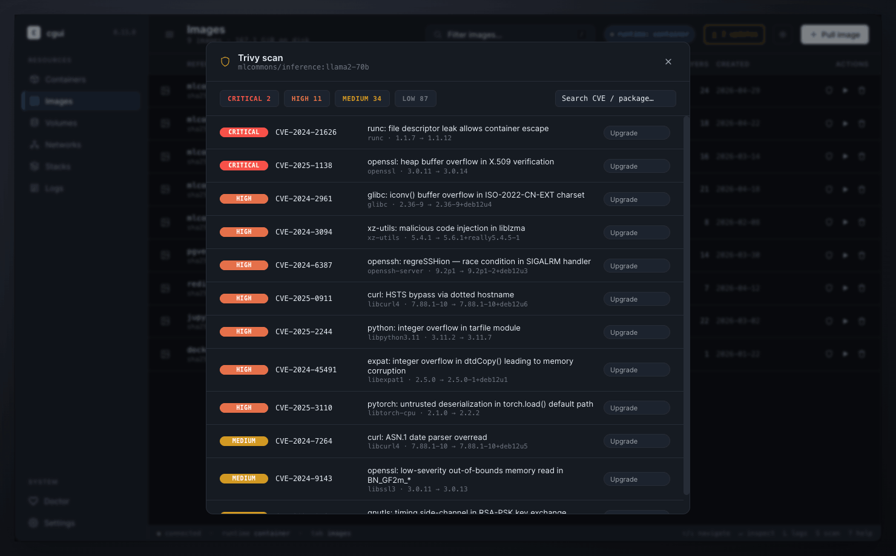

<h1 align="center">cgui-visual</h1>

<p align="center">
  <strong>Desktop GUI for Apple's <a href="https://github.com/apple/container"><code>container</code></a> runtime.</strong><br/>
  Tauri 2 · React · TypeScript · macOS only.
</p>

<p align="center">
  <a href="https://github.com/elementalcollision/cgui-visual/actions/workflows/ci.yml"></a>
  <a href="https://github.com/elementalcollision/cgui-visual/releases/latest"></a>
  <a href="./LICENSE"></a>
  
  <a href="https://tauri.app"></a>
</p>

<p align="center">
  
</p>

<p align="center">
  The visual companion to the <a href="https://github.com/elementalcollision/cgui"><code>cgui</code></a> ratatui TUI — same workflows, different surface.
</p>

> **Looking for the TUI?** It lives in [elementalcollision/cgui](https://github.com/elementalcollision/cgui).

## How it compares

cgui-visual targets a specific niche: **devs on Apple Silicon who want a GUI for Apple's first-party `container` runtime**, MIT-licensed, with no commercial license to manage and no Linux VM to feed memory to.

|                          | **cgui-visual**                | Docker Desktop                   | OrbStack            | Podman Desktop      | Lazydocker         |
| ------------------------ | ------------------------------ | -------------------------------- | ------------------- | ------------------- | ------------------ |
| **License**              | MIT — free for any use         | Free for personal; paid for biz  | Paid (free trial)   | Apache-2.0          | MIT                |
| **Platforms**            | macOS                          | macOS · Windows · Linux          | macOS               | macOS · Windows · Linux | macOS · Windows · Linux |
| **Backing runtime**      | Apple `container`              | Docker Engine                    | OrbStack engine     | Podman              | Docker             |
| **Surface**              | Native desktop GUI             | Native desktop GUI               | Native desktop GUI  | Native desktop GUI  | Terminal (TUI)     |
| **Compose-style stacks** | TOML stacks · Compose import roadmap | `docker-compose.yml`       | `docker-compose.yml`| Compose plugin      | View-only          |
| **Image vuln scanning**  | Trivy (`brew install trivy`)   | Snyk (paid tier)                 | —                   | —                   | —                  |
| **Bundle size on disk**  | ~10 MB                         | ~1 GB (incl. engine)             | ~600 MB             | ~400 MB             | ~10 MB             |

**TL;DR by audience:**
- **You're already using `cgui` (TUI)** → cgui-visual is the visual companion. Same stacks, same workflows, same `~/.config/cgui/`.
- **Coming from Docker Desktop** → cgui-visual is one of the lightest exits, but you'll be on Apple's `container` runtime instead of Docker Engine. Compose-import is on the roadmap.
- **Considering OrbStack** → OrbStack is more polished and cross-runtime; cgui-visual is free, OSS, and laser-focused on Apple's runtime.
- **You like terminal-first tooling** → use [`cgui`](https://github.com/elementalcollision/cgui) (TUI) directly; cgui-visual is for when you want a GUI alongside it.

## What it does

- **Containers** — list / inspect / start / stop / restart / kill / delete with live CPU, memory, network, disk rates derived from `container stats` deltas
- **Images** — list / inspect / Trivy scan / run (with name, ports, env, command form) / delete
- **Volumes / Networks** — list with reference counts, JSON inspect, delete
- **Stacks** — TOML compose-style at `~/.config/cgui/stacks/*.toml`; up/down with topological ordering; live TCP/HTTP/cmd healthchecks with `start_period_s` grace window
- **Logs** — streaming `container logs -f` with 5 000-line ring buffer, level filter, free-text search
- **Pull** — streaming `container image pull` with progress
- **Doctor** — local-environment health check
- **Self-update** — Tauri-updater plugin against a GitHub-Pages-hosted manifest

## Layout

```
.
├── app/                    Tauri + React + TS desktop app  ← start here
│   ├── README.md           Setup, dev workflow, architecture
│   ├── src/                Frontend
│   ├── src-tauri/          Rust backend
│   └── …
├── design_handoff_cgui/    Original clickable HTML prototype + screenshots
│   ├── README.md
│   ├── prototype/
│   └── screenshots/
├── CHANGELOG.md
├── CONTRIBUTING.md
└── LICENSE                 MIT
```

The bulk of the project documentation is in [`app/README.md`](./app/README.md).
The [design handoff](./design_handoff_cgui/README.md) documents the three
variations (Workbench, Editorial, Terminal) the prototype carried; the
shipping app uses the **Workbench** variation.

## Quickstart

```sh
cd app
npm install
npm run tauri dev
```

Apple's `container` CLI is optional — when absent, the app falls back to
fixture data so the UI is fully usable for design work.

## License

MIT — see [LICENSE](./LICENSE).
